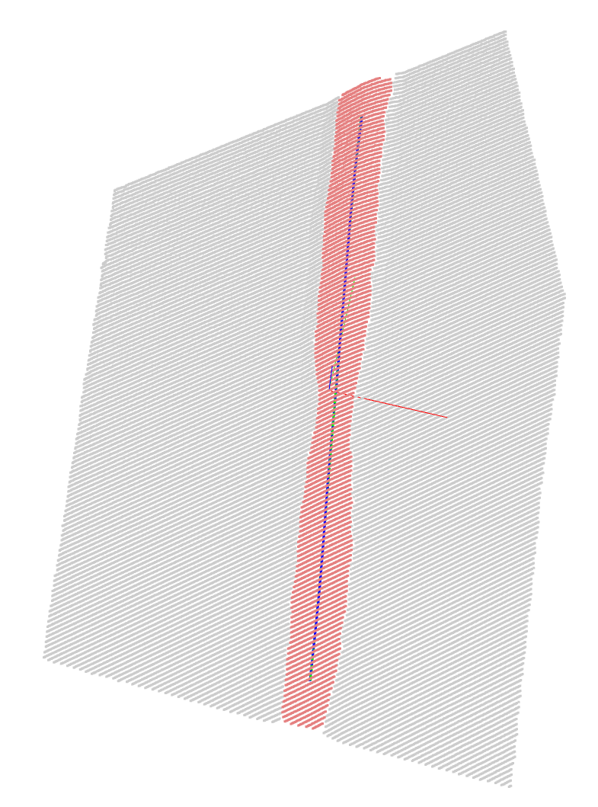
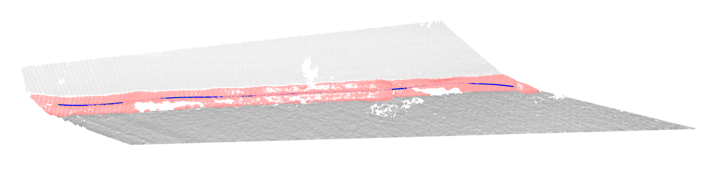
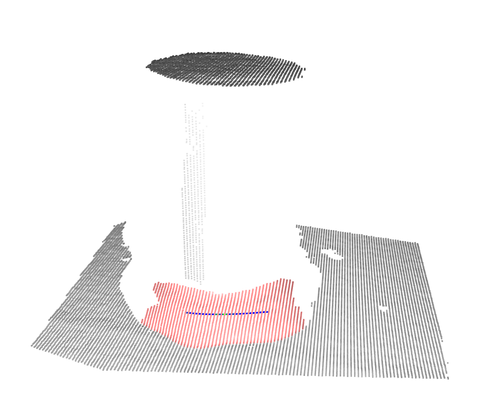

# Automated 3D Weld Bead Centerline Extraction

This project provides a Python-based solution for automatically classifying and extracting the centerline from 3D point cloud data of various weld bead types. The script is designed to handle different weld geometries, such as flat plate welds, corner (fillet) welds, and cylindrical welds, by first identifying the weld type and then applying a specialized processing pipeline for each case.

## How It Works

The workflow is a multi-stage pipeline designed for accuracy and robustness:

1.  **Weld Type Classification:** The main script first loads a point cloud and passes it to the `determine_weld_type` function. This function analyzes the point cloud's eigenvalues to determine its fundamental shape (planar, linear, etc.) and classifies it.

2.  **Specialized Processing:** Based on the classification result, the script calls the appropriate processing module from the `utils` directory (`flat_bead.run()`, `corner_bead.run()`, etc.). Each of these modules contains a segmentation algorithm optimized for that specific geometry.

3.  **Centerline Extraction & Cleaning:** After the weld bead is segmented, the resulting point cloud is passed to the `clean_and_smooth_centerline` function. This function performs the final graph-based cleaning and B-spline smoothing to produce the final, high-quality waypoints.

## Usage

1.  **Place Data:** Put your point cloud files (e.g., in `.pcd` format) into the `data/` directory.

2.  **Run Script:** Execute the main script from your terminal. The script will automatically load the point cloud, classify it, and run the appropriate processing pipeline.

    ```bash
    python waypoint_estimation.py
    ```

3.  **Visualize:** The script uses the Open3D library to provide several visualization windows, showing the initial data, the segmentation result, and the final extracted centerline.

## Dependencies

This project relies on the following Python libraries. You can install them using pip:

```bash
pip install open3d numpy scipy matplotlib
```

## Results

Below are some example results from the processing pipeline.

### Flat Plate Weld Centerline

*The final output is a smooth, ordered set of waypoints (yellow) representing the precise centerline of the weld bead.*



### Corner Weld Centerline

*The final output is a smooth, ordered set of waypoints (yellow) representing the precise centerline of the weld bead.*



### Cylinder Weld Centerline

*The final output is a smooth, ordered set of waypoints (yellow) representing the precise centerline of the weld bead.*




## Modules

-   `main.py`: The main entry point of the application. It handles file loading, calls the classifier, and orchestrates the processing flow.
-   `utils/weld_type_cls.py`: Contains the `determine_weld_type` function for classifying the point cloud.
-   `utils/flat_bead.py`: The processing pipeline specifically for welds on flat or near-flat surfaces.
-   `utils/corner_bead.py`: The processing pipeline for fillet welds found in corners.
-   `utils/cylinder_bead.py`: The processing pipeline for welds on cylindrical surfaces.
-   `utils/centerline2graph.py`: Contains the `clean_and_smooth_centerline` function for cleaning and smoothing the final centerline.
